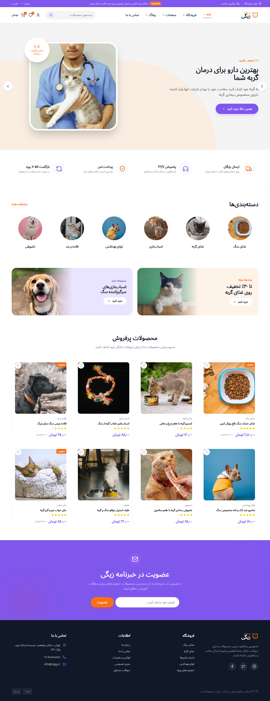

# 🐾 PetShop React Template

A modern, responsive, and SEO-friendly React template built for Pet Shops, Veterinary Clinics, Animal Care Centers, Pet Grooming Services, and Pet E-commerce Businesses.

Designed with performance, scalability, and user experience in mind, this template helps businesses showcase products, services, testimonials, and appointment booking functionality with a clean and modern interface.

---

## 🚀 Live Demo

👉 Demo: https://petshop-react-template.vercel.app

---

## 📸 Screenshots

### Homepage



### Services Section


### Appointment Booking


---

## ✨ Features

* ⚛️ Built with React 18 + Vite
* 📱 Fully Responsive Design
* 🌙 Dark & Light Mode
* 🛒 Shopping Cart UI
* 📅 Appointment Booking Interface
* 🐶 Pet Products Showcase
* 🏥 Veterinary Services Section
* 💬 Customer Testimonials
* 📧 Contact Form
* 🔍 SEO-Friendly Structure
* 🚀 Fast Loading Performance
* ♻️ Reusable Components
* 🎨 Clean and Modern Design
* 🔧 Easy Customization

---

## 🏗️ Tech Stack

* React.js
* Vite
* TypeScript (Optional)
* React Router DOM
* Axios
* Tailwind CSS
* CSS Modules

---

## 📂 Project Structure

```bash
src/
│
├── assets/
├── components/
├── pages/
├── hooks/
├── services/
├── routes/
├── layouts/
├── context/
└── utils/
```

---

## ⚡ Getting Started

Clone the repository:

```bash
git clone https://github.com/seyedahmaddev/petshop-react-template.git
```

Navigate to project directory:

```bash
cd petshop-react-template
```

Install dependencies:

```bash
npm install
```

Start development server:

```bash
npm run dev
```

Build for production:

```bash
npm run build
```

---

## 🔍 SEO Features

This template is built with SEO best practices:

* Semantic HTML Structure
* Mobile-Friendly Design
* Optimized Performance
* Fast Initial Load
* Lighthouse Friendly
* Clean URL Structure
* Open Graph Ready
* Social Sharing Support
* Responsive Images

---

## 🎯 Perfect For

* Pet Shop Websites
* Veterinary Clinics
* Pet Grooming Services
* Animal Care Centers
* Pet Adoption Platforms
* Pet Food Stores
* Pet Accessories Stores
* Pet E-commerce Businesses

---

## 💼 Custom Development Services

Need a custom version of this template?

I provide professional frontend development services using React.js and Next.js.

Services include:

* Custom Website Development
* Landing Pages
* Business Websites
* E-commerce Platforms
* Dashboards & Admin Panels
* API Integration
* Progressive Web Apps (PWA)
* Website Optimization
* SEO Improvements

---

## 👨‍💻 About the Developer

Hi, I'm Seyed Ahmad Gholami.

Frontend Developer specializing in:

* React.js
* Next.js
* TypeScript
* Tailwind CSS
* JavaScript
* Responsive Web Design

I help startups and businesses build fast, scalable, and modern web applications.

---

## 🌍 Languages Supported

* English
* فارسی (Persian)
* العربية (Arabic)
* Türkçe (Turkish)
* Deutsch (German)

---

## 📬 Contact

### LinkedIn

http://linkedin.com/in/seyedahmaddev/

### GitHub

https://github.com/seyedahmaddev

---

## ⭐ Support

If you find this project useful, please consider giving it a star on GitHub.

Your support helps improve the project and create more open-source templates.

---

## 🤝 Contributing

Contributions, issues, and feature requests are welcome.

Feel free to fork the repository and submit pull requests.

---

## 📄 License

MIT License

---

## 🔑 Keywords

React Pet Shop Template, React Pet Store Website, Veterinary Clinic Website Template, Pet Shop Landing Page, React E-commerce Template, Next.js Pet Store, Animal Care Website, Pet Grooming Website, Responsive React Template, SEO Friendly React Website, Pet Products Store, React Business Website Template, Tailwind CSS Template, Modern React UI, Pet Shop Web Application.
